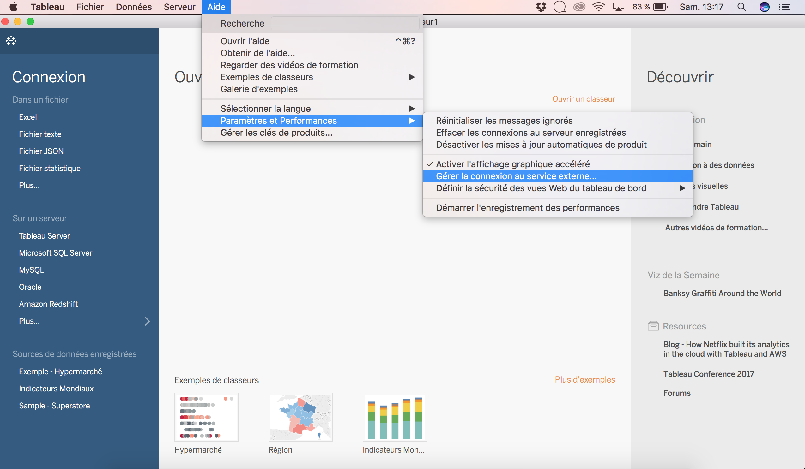
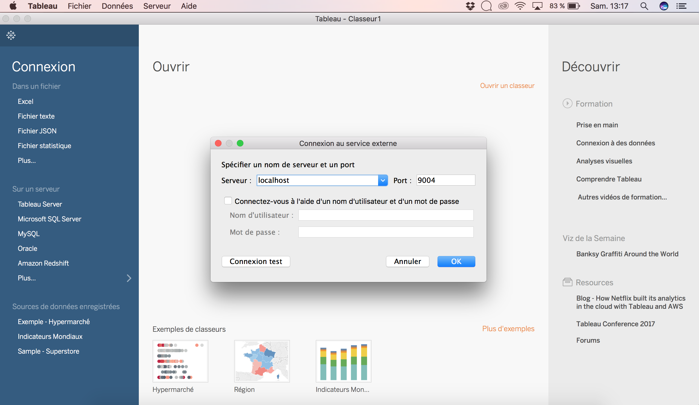
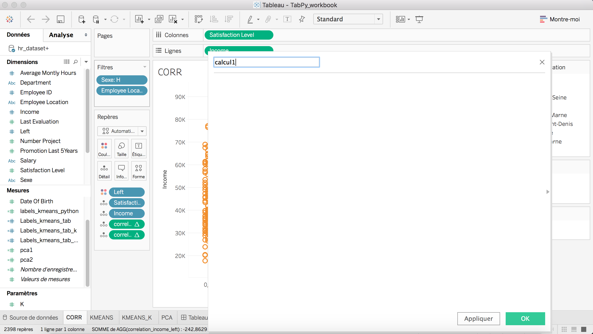
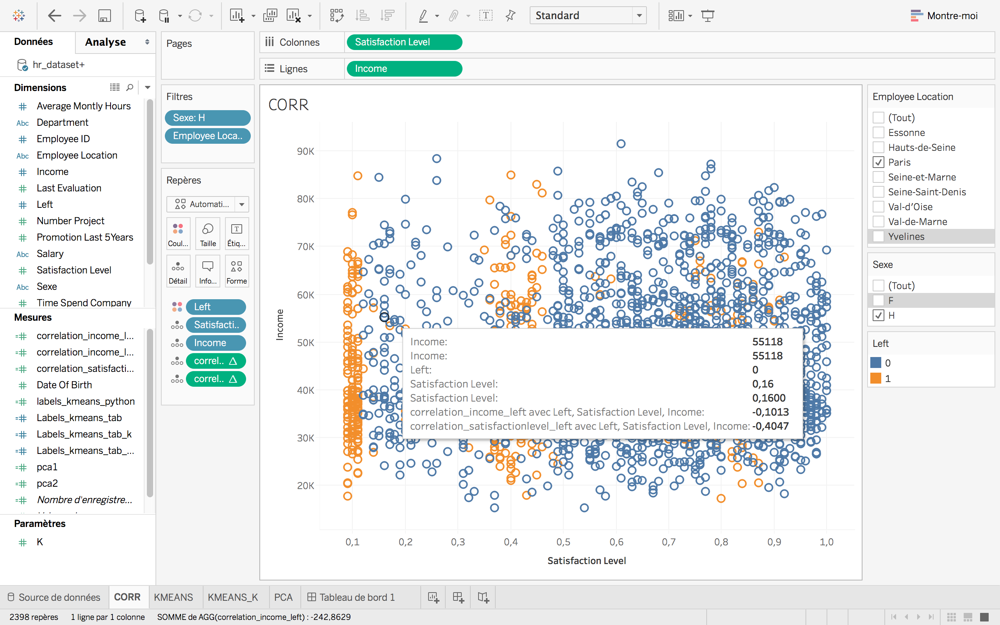
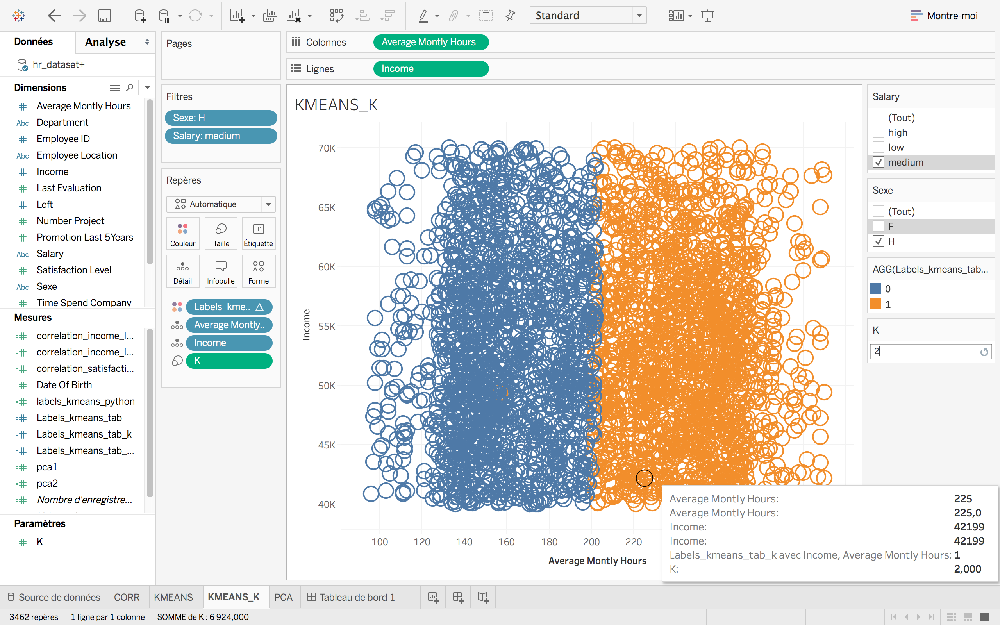
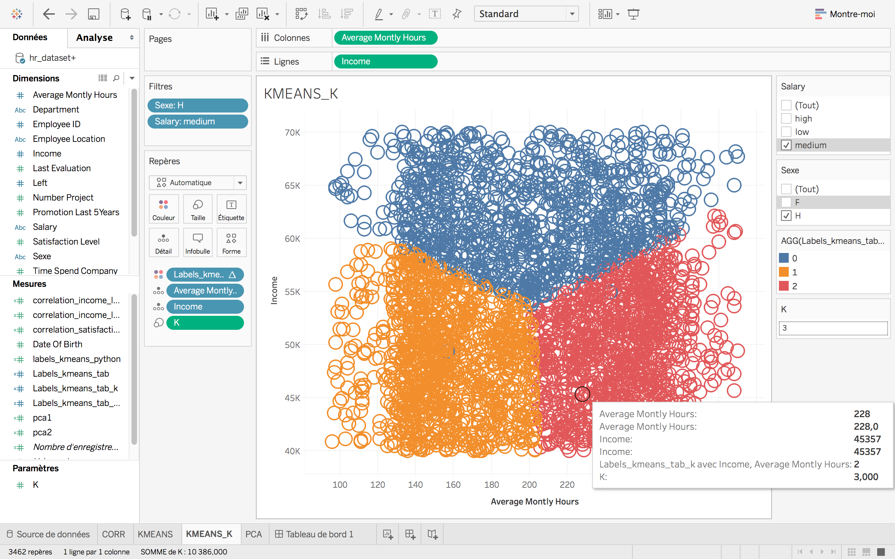
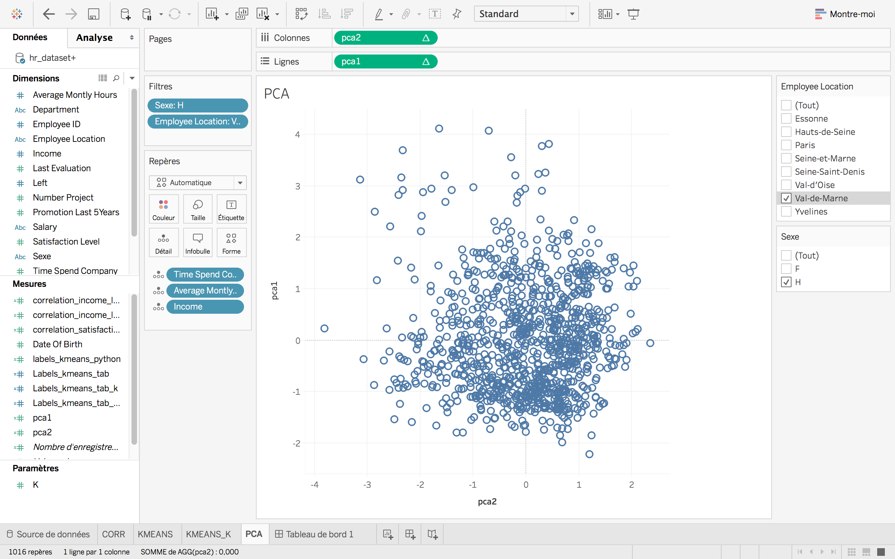

# Tutorial: Expand Tableau software power with Python
January 2017

* Author: Consultant, Data scientist - Baccar Clement -  [clement.baccar@saegus.com](clement.baccar@saegus.com)
### Context

TabPy framework allow Tableau to remotely execute  Python code.

It has two components:
* a server process which enables remote execution of python code.
* a client library  that enables the deployments of such endpoint.

Tableau can connect to the TabPy server to execute Python code on the fly and dispay results in Tableau. Users can control data and parameters being sent to TabPy  by interacting with their Tableau worksheets, dashboard or stories

## Requirements

* Tableau Software 10.1 and above: [download here](https://www.tableau.com/fr-fr/products/trial)

* Python 2.7 and above: [download here](https://github.com/tableau/TabPy)

* Python-Tableau server package - TabPy: [download here](https://github.com/tableau/TabPy)


### Install TabPy :

Download the TabPy package   `git clone git://github.com/tableau/TabPy`  
or [ here](https://github.com/tableau/TabPy)


and launch the `setup.sh `  or `setup.bat` (on Windows).

Then Tabpy is starting up and listens on port `9004`

###  Setup Tableau software:

In Tableau server 10.1 a connection to TabPy can be added

`Help > Settings and Performance > Manage External Service Connection`

* step 1 :



* step 2:



Create a new worksheet with any data source.

# Tutorial

This tutorial uses the `hr_dataset.csv` dataset available on [sharepoint](https://saegus.sharepoint.com/sites/digdash/Documents%20partages/Forms/AllItems.aspx?id=%2Fsites%2Fdigdash%2FDocuments%20partages%2Fdatasets%2Fhr)

## Calculate correlation coefficient using a Calculated field


To create a calculated field: `analysis > create a calculated field`



To compute the pearson correlation coefficient between two variables use the following calculated field.

```
SCRIPT_REAL('
  import numpy as np
  return np.corrcoef(_arg1,_arg2)[0,1]
',
AVG([Income]),AVG([Left])
)  
```
`_arg1` and `_arg2` are the parameters passed to the `SCRIPT_REAL` function.

`SCRIPT_REAL`,`SCRIPT_BOOL`, `SCRIPT_INT`,`SCRIPT_STR` define the value type that will be return by the script function.

It can be used for `R` or `Python` script

Then display the correlation coefficient on the details windows.




Notice that the correlation coefficient is compute with the displayed data on the worksheet.

## Visualize a Kmeans algorithm output executed in an external python code

This part describes how to execute a very simple clustering algorithm: Kmeans, in a python script  and then displayed in Tableau.

Create a new python script, let's called it : `kmeans.py`

```
import tabpy_client
import numpy as np
from sklearn.cluster import KMeans
from sklearn.preprocessing import StandardScaler
connection = tabpy_client.Client('http://localhost:9004/')

def kmeans(var1,var2,kcluster):
	X = np.column_stack([var1,var2])
	X = StandardScaler().fit_transform(X)
	kmeans = KMeans(n_clusters=int(kcluster[0]), random_state=0).fit(X)
	return kmeans.labels_.tolist()

connection.deploy('Kmeans-clust',kmeans,'Returns the clustering label for each individual',override=True)

```
Then execute the python script by : `python kmeans.py` to deploy the `kmeans` function.

* `tabpy_client.Client('http://localhost:9004/')` create a connection between our python script and TabPy (listens by Tableau Software).


* `connection.deploy()` deploy our python function called `kmeans` to TabPy server.
* `override=True` enable to re-write and modify the `kmeans` function.

* `kmeans()` define our clustering function and return the output labels.

The Kmeans algorithm requires to choose ,a priori, the K - number of cluster.

Create a new parameter called `K` that could be modified and change the given number of cluster.

Create a new calculated field with the following structure:

```
SCRIPT_REAL('
return tabpy.query("Kmeans-clust",_arg1,_arg2,_arg3)["response"]',
ATTR([Income]),ATTR([Average Montly Hours]),
[K]
)
```
The labels might be display on a two-dimensional mapping. Display the `K` parameter and change the actual value of K cluster.

* for K=2



* for K=3



Notice that  the K-Means algorithm is compute with the actual dataset displayed on the worksheet.


## Dimension reduction with PCA on Tableau

The main linear technique for dimensionality reduction, principal component analysis, performs a linear mapping of the data to a lower dimensional space in such a way that the variance of the data in the low-dimensional space representation is maximized (wikipedia)

In this example, we choose three variables: `Income`, `Average Monthly Hours`, `Time Spend Company` that we would like to display on a two-dimensional space.

So we created two python script returning the components coordinates: `pca1.py` and `pca2.py`.


```
import tabpy_client
import numpy as np
from sklearn.decomposition import PCA
from sklearn.preprocessing import StandardScaler
connection = tabpy_client.Client('http://localhost:9004/')

def pca1(_arg1,_arg2,_arg3):
	X = np.column_stack([_arg1,_arg2,_arg3])
	X = StandardScaler().fit_transform(X)
	pca = PCA(n_components=2)
	pca.fit(X)
	X = pca.transform(X)

	return X[:,0].tolist()

connection.deploy('pca1',pca1,'Returns PCA coordinate 1',override=True)
```
`pca2.py` returns `X[:,1]`

Called the pca functions with the following calculated field:

```
SCRIPT_REAL('
return tabpy.query("pca1",_arg1,_arg2,_arg3)["response"]',
ATTR([Income]),ATTR([Average Montly Hours]),ATTR([Time Spend Company])
)
```




Notice:

* the PCA is compute with the actual dataset displayed on the worksheet.

* to properly interpret data, PCA requires a deeper statistical analysis (correlation circle, eigenvalues and eigenvector analysis)

## Go further

Example of new tools that could be implemented in Tableau Software:

* Provided more insight to select the right number of k in Kmeans (inertia analysis for k going from 1 to 10)
* Provided more statistics insight to perform a proper PCA analysis (correlation circle, eigenvalues analysis)
* Provided other algorithm to dimension reduction (non linear)
* Performed predictive analysis on the `left` variable. (cf. Kaggle python script)
* similar tools could be implemented in `R` on Tableau and on `Digdash`
